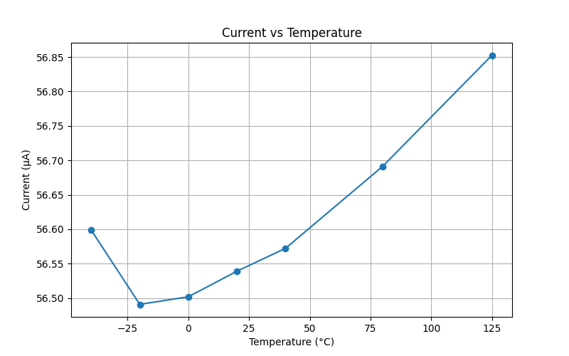

# Who
Halvor, Marte, Siver, Michal

# Why

Milestone 1 AIC

# How

Designed Opamp based on design shown in class
Designed temperature sensing circuit based on design shown in class
Spend a long time figuring out github workflows and linux

# Problems present
The circuit shows linearity from -25 degrees to 125 degrees, at -40 something strange happens
Simulation not set up to read current, current is calculated based on voltage difference over R1 using python

# Ways to fix
Figure out how to measure current, and do operating point analysis on opamp transistors.
The transistors in the opamp have been chosen to match the current ratio between the mirrors. Appropriate R1 value has to be found in order to get transistors in active area
Not much thought has been given to transistors in JNW_GR04 circuit. Need to ensure that these are in active region aswell.

# What

| What            |        Cell/Name |
| :-              |  :-:       |
| Schematic       | design/JNW_GR04_SKY130A/JNW_GR04.sch |
| Layout          | design/JNW_GR04_SKY130A/JNW_GR04.mag |

# Changelog/Plan

| Version | Status | Comment|
| :---| :---| :---|
|0.1.0 | :x: | Make something |

# Signal interface

| Signal       | Direction | Domain  | Description                               |
| :---         | :---:     | :---:   | :---                                      |
| VDD_1V8         | Input     | VDD_1V8 | Main supply                              |
| VSS         | Input     | Ground  |                                           |
| PWRUP_1V8     | Input    | VDD_1V8 | Power up the circuit                       |

# Key parameters

| Parameter           | Min     | Typ           | Max     | Unit  |
| :---                | :---:     | :---:           | :---:     | :---: |
| Technology          |         | Skywater 130 nm |         |       |
| AVDD                | 1.7    | 1.8           | 1.9    | V     |
| Temperature         | -40     | 27            | 125     | C     |
