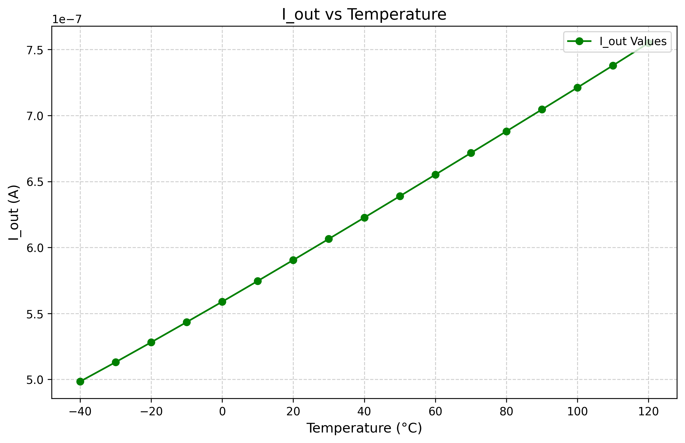
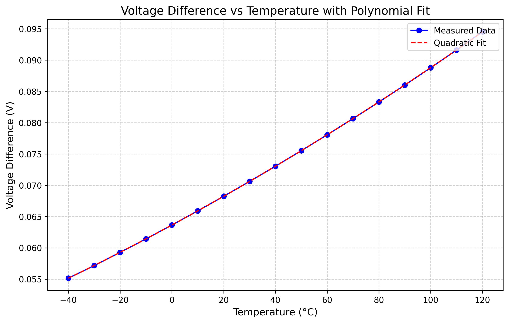

# Who
Group 4: Michal, Siver, Marte, Halvor

# Why

Our goal is to make a temperature sensor for the semester project in TFE4188. 

# How

To design the temperature sensor, we are using Xschem for circuit design and simulating the behavior with ngspice. 
The design is split into two different parts: a circuit that generates a current that is Proportional to Absolute Temperature (PTAT) and a circuit that converts the current temperature to a digital output. 
## The PTAT circuit (PTAT.sch)

The PTAT circuit is designed using two diodes biased at different currents connected to the two inputs of an amplifier. This results in a temperature dependent current over a resistor connected to one of the diodes. The temperature current is then mirrored using a transistor, giving the temperature dependent current output called I_out. 

The schematic can be found in the design/JNW_GR04_SKY130A folder and is named PTAT.sch. The circuit includes a single-stage differential amplifier called Opamp_test.sch.

The PTAT circuit was simulated for different temperatures, below is a plot of the I_OUT current vs temp: 

The current I_OUT does not give an exact linear relation to the temperature, likely due to the opamp not being ideal. 

Below is a plot of the voltage difference across the resistor, the voltage does not give a linear relation to the temperature either. (Add something about the quadratic fit)

## The digital output circuit (Comparator.sch)

The digital output circuit consists of the PTAT circuit, where the temperature dependent current is called I_PTAT for this instance. The digital output circuit consist of a comparator, called Opamp_comp.sch, which compares I_PTAT to a reference voltage Vref at 1V. If I_PTAT becomes larger than Vref, the output of the comparator becomes high. The time it takes for the comparator to give a high output depends on the temperature, which is a result of a higher temperature equaling a larger current and vice versa. 

Below is a plot of the output OUT simulated for different temperatures. 

## The code block

The verilog code increments a counter variable for every clock cycle until Comparator gives logical high on the output.

| Temperature (°C) | Counter |
|-----------------|---------|
| -40            |         |
| -20            |         |
| 0              |         |
| 20             |         |
| 40             |         |
| 60             |         |
| 80             |         |
| 100            |         |
| 120            |         |

# Problems present

The PTAT circuit does not give an exact linear relation to the temperature, to make the relation more similiar we would need to further work on the opamp used in the circuit. 

Ideally we would simulate the opamps stability. 
We also need to simulate for different corners and add a power up functonality. 

# What

| What            |        Cell/Name |
| :-              |  :-:       |
| Schematic       | design/JNW_GR04_SKY130A/JNW_GR04.sch |
| Layout          | design/JNW_GR04_SKY130A/JNW_GR04.mag |
| Schematic       | design/JNW_GR04_SKY130A/Comparator.sch |
| Schematic       | design/JNW_GR04_SKY130A/PTAT.sch |
| Schematic       | design/JNW_GR04_SKY130A/Opamp_test.sch |
| Schematic       | design/JNW_GR04_SKY130A/Opamp_comp.sch |

# Changelog/Plan

| Version | Status | Comment|
| :---| :---| :---|
|0.1.0 | :white_check_mark: | Milestone 1: Convert from a temperature into a current |
|0.1.1 | :white_check_mark: | Milestone 2: Convert from a temperature into a digital value |
|0.1.2 | :x: | Milestone 3: Layout |
|0.1.3 | :x: | Milestone 4: Report |
# Signal interface

| Signal       | Direction | Domain  | Description                               |
| :---         | :---:     | :---:   | :---                                      |
| VDD_1V8         | Input     | VDD_1V8 | Main supply                              |
| VSS         | Input     | Ground  |        
| RST         | Input     | Reset the comparator circuit   |                                        
| PWRUP_1V8     | Input    | VDD_1V8 | Power up the circuit                       |
| OUT         | Output     | Digital output   | 

# Key parameters

| Parameter           | Min     | Typ           | Max     | Unit  |
| :---                | :---:     | :---:           | :---:     | :---: |
| Technology          |         | Skywater 130 nm |         |       |
| AVDD                | 1.7    | 1.8           | 1.9    | V     |
| Temperature         | -40     | 27            | 120     | C     |
