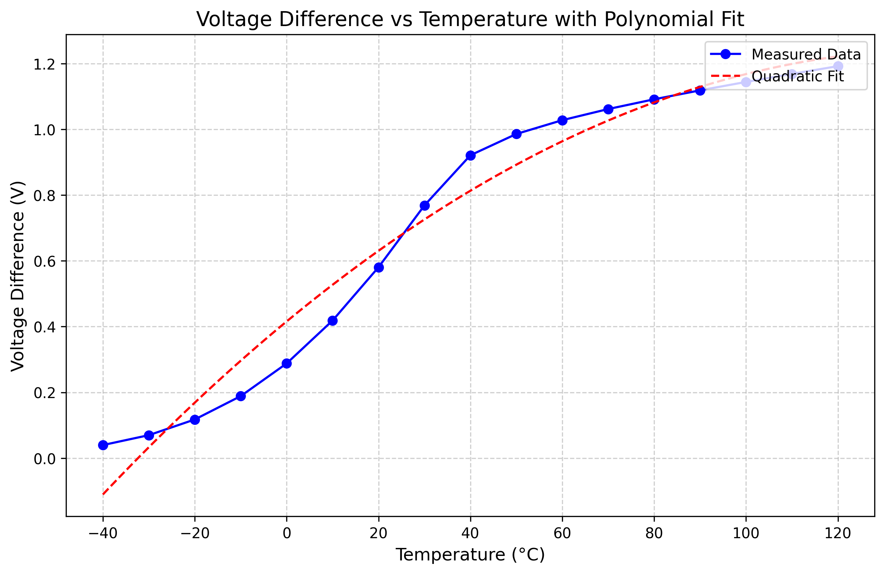

# Who
Group 4: Michal, Siver, Marte, Halvor

# Why

For a project in TFE4188

# How

Below is a plot of the current vs temperature

# Problems present

# What

| What            |        Cell/Name |
| :-              |  :-:       |
| Schematic       | design/JNW_GR04_SKY130A/JNW_GR04.sch |
| Layout          | design/JNW_GR04_SKY130A/JNW_GR04.mag |

# Changelog/Plan

| Version | Status | Comment|
| :---| :---| :---|
|0.1.0 | :x: | Make something |

# Signal interface

| Signal       | Direction | Domain  | Description                               |
| :---         | :---:     | :---:   | :---                                      |
| VDD_1V8         | Input     | VDD_1V8 | Main supply                              |
| VSS         | Input     | Ground  |                                           |
| PWRUP_1V8     | Input    | VDD_1V8 | Power up the circuit                       |

# Key parameters

| Parameter           | Min     | Typ           | Max     | Unit  |
| :---                | :---:     | :---:           | :---:     | :---: |
| Technology          |         | Skywater 130 nm |         |       |
| AVDD                | 1.7    | 1.8           | 1.9    | V     |
| Temperature         | -40     | 27            | 120     | C     |
