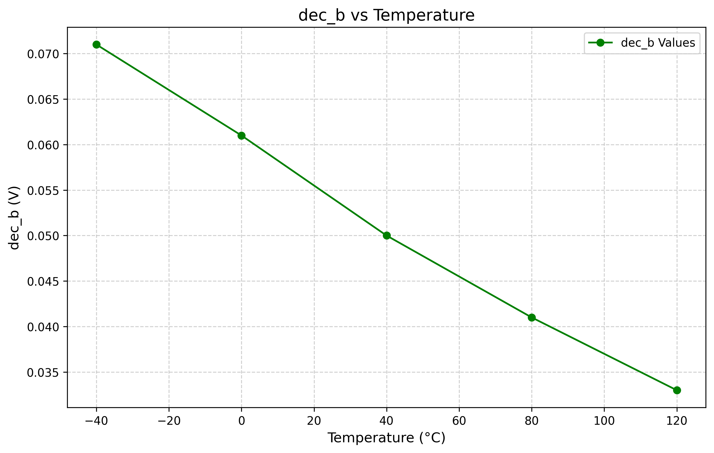

# Who
Group 4: Michal, Siver, Marte, Halvor

# Why

Our goal is to make a temperature sensor for the semester project in TFE4188. 

# How

To design the temperature sensor, we are using Xschem for circuit design and simulating the behavior with ngspice. 
The design is split into two different parts: a circuit that generates a current that is Proportional to Absolute Temperature (PTAT) and a circuit that converts the current temperature to a digital output.

## ERRORS
LVS does not pass, we think this is because the layout file for the Schmitt trigger is wrong, we have attempted to fix this but are unsure wether or not it was correct.
GDS does not pass, some errors with paths, according to the output, the 3D design file has been generated locally.
Digital Block is not present in top level file, but we have made it. It can be found in design/JNW_GR04_SKY130A/temp_to_dig.mag

## Layout (Digital Block not included)
Picture of the analog circuit layout

## The PTAT circuit (PTAT.sch)

The PTAT circuit is designed using two diodes biased at different currents connected to the two inputs of an amplifier. This results in a temperature dependent current over a resistor connected to one of the diodes. The temperature current is then mirrored using a transistor, giving the temperature dependent current output called I_out. 

The schematic can be found in the design/JNW_GR04_SKY130A folder and is named PTAT.sch. The circuit includes a single-stage differential amplifier called Opamp_test.sch.

The PTAT circuit was simulated for different temperatures, below is a plot of the I_OUT current vs temp: 

The current I_OUT gives an almost proportional temperature/current relationship. We think this is good enough.

## The digital output circuit (Comparator.sch)

The digital output circuit consists of the PTAT circuit, where the temperature dependent current is called I_PTAT for this instance. The digital output circuit consist of a comparator, called Opamp_comp.sch, which compares I_PTAT to a reference voltage Vref at 1V. If I_PTAT becomes larger than Vref, the output of the comparator becomes high. The time it takes for the comparator to give a high output depends on the temperature, which is a result of a higher temperature equaling a larger current and vice versa. 

## The code block

The verilog code increments a counter variable for every clock cycle until Comparator gives logical high on the output.
We can then estimate current based on the below plot (this can be done externally)

# Problems present
The current at negative 40 degrees is really low - as shown on the above plot, the comparator takes alot more clock cycles to give logical high on the output.
We can fix this by adding a offset to shift the current higher.

Ideally we would simulate the opamps stability. 
We also need to simulate for different corners and add a power up functonality. 

# What

| What            |        Cell/Name |
| :-              |  :-:       |
| Schematic       | design/JNW_GR04_SKY130A/JNW_GR04.sch |
| Layout          | design/JNW_GR04_SKY130A/JNW_GR04.mag |
| Schematic       | design/JNW_GR04_SKY130A/Comparator.sch |
| Schematic       | design/JNW_GR04_SKY130A/PTAT.sch |
| Schematic       | design/JNW_GR04_SKY130A/Opamp_test.sch |
| Schematic       | design/JNW_GR04_SKY130A/Opamp_comp.sch |

# Changelog/Plan

| Version | Status | Comment|
| :---| :---| :---|
|0.1.0 | :white_check_mark: | Milestone 1: Convert from a temperature into a current |
|0.1.1 | :white_check_mark: | Milestone 2: Convert from a temperature into a digital value |
|0.1.2 | :x: | Milestone 3: Layout |
|0.1.3 | :x: | Milestone 4: Report |
# Signal interface

| Signal       | Direction | Domain  | Description                               |
| :---         | :---:     | :---:   | :---                                      |
| VDD_1V8         | Input     | VDD_1V8 | Main supply                              |
| VSS         | Input     | Ground  |        
| RST         | Input     | Reset the comparator circuit   |                                        
| PWRUP_1V8     | Input    | VDD_1V8 | Power up the circuit                       |
| OUT         | Output     | Digital output   | 

# Key parameters

| Parameter           | Min     | Typ           | Max     | Unit  |
| :---                | :---:     | :---:           | :---:     | :---: |
| Technology          |         | Skywater 130 nm |         |       |
| AVDD                | 1.7    | 1.8           | 1.9    | V     |
| Temperature         | -40     | 27            | 120     | C     |
